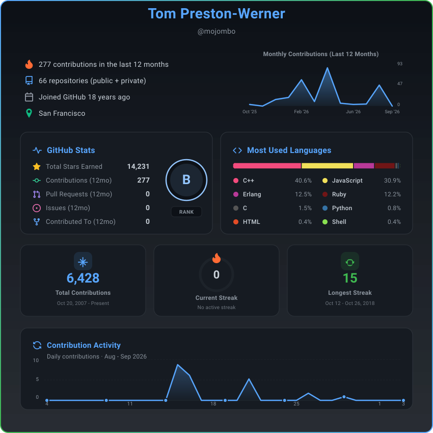

<h1 align="center">GitHub Insights</h1>

<p align="center">
  <a href="https://github-profiles-insights.vercel.app/api/insight?username=mojombo&theme=github_dark&graph=true&languages=true&streak=true&stats=true&header=true&summary=true&profile=true">
    
  </a>
</p>

<p align="center">
  <strong>Generate beautiful, customizable GitHub stats cards and 3D contribution profiles for your README</strong>
</p>

<p align="center">
  <a href="https://github-profiles-insights.vercel.app">Live Demo</a> •
  <a href="#features">Features</a> •
  <a href="#usage">Usage</a> •
  <a href="#self-hosting">Self-Hosting</a>
</p>

---

## Features

- 📊 **Comprehensive Stats** - Commits, PRs, issues, stars, and more
- 🔥 **Streak Tracking** - Current and longest contribution streaks
- 📈 **Contribution Graph** - 31-day activity line chart card
- 🃏 **Standalone Cards** - `insight`, `stats`, `graph`, or `streak`
- 🧊 **Profile 3D Contribution** - 3D calendar with radar & languages (`/api/contrib-3d`)
- 🎨 **Card Themes** - Multiple themes including Aurora Night and Ember Void
- 🙈 **Language Filtering** - Hide specific languages from insight cards
- 🌗 **Site Theme Toggle** - Light, Dark, and System mode
- 📥 **Download Options** - Export as SVG, PNG, or JPG
- ⚡ **Fast & Cached** - Smart caching for quick loads
- 📱 **Responsive UI** - Mobile-friendly generator studio

## Usage

### Quick Start

**Insight card:**

```markdown
<p align="center">
  
</p>
```

**3D contribution profile:**

```markdown
<p align="center">
  
</p>
```

Replace `YOUR_USERNAME` with your GitHub username.

<details>
<summary><strong>📊 Insight Cards</strong> — formats, themes, parameters & examples</summary>

<br>

### Card types

| `card` | Description |
|--------|-------------|
| `insight` (default) | Full analytics card with modular sections |
| `stats` | Stars, contributions, PRs, issues, contributed-to & rank |
| `graph` | 31-day contribution line chart |
| `streak` | Total contributions, current streak & longest streak |

### Parameters

| Parameter | Default | Description |
|-----------|---------|-------------|
| `username` | Required | Your GitHub username |
| `card` | `insight` | Card type: `insight`, `stats`, `graph`, or `streak` |
| `theme` | `github_dark` | Card theme |
| `transparent` | `false` | Transparent background (streak card only) |
| `profile` | `true` | Show name & username |
| `header` | `true` | Show monthly contribution chart |
| `summary` | `true` | Show summary info (contributions, repos, join date) |
| `stats` | `true` | Show GitHub stats section |
| `languages` | `true` | Show top programming languages |
| `streak` | `true` | Show streak statistics |
| `graph` | `true` | Show contribution graph section |
| `hide_langs` | _(none)_ | Comma-separated languages to exclude (e.g. `HTML,CSS`) |

### Examples

Full insights:

```markdown
<p align="center">
  
</p>
```

Stats card:

```markdown
<p align="center">
  
</p>
```

Graph card:

```markdown
<p align="center">
  
</p>
```

Streak card:

```markdown
<p align="center">
  
</p>
```

Add `&transparent=true` to the streak card for a transparent background. Example: `theme=ember_void&transparent=true`.

Hide languages:

```markdown
<p align="center">
  
</p>
```

### Themes

| Theme | Preview |
|-------|---------|
| `github_dark` | [](https://github-profiles-insights.vercel.app/api/insight?username=mojombo&theme=github_dark&graph=false&languages=false&streak=false&stats=false&header=false&summary=false&profile=true) |
| `github_light` | [](https://github-profiles-insights.vercel.app/api/insight?username=mojombo&theme=github_light&graph=false&languages=false&streak=false&stats=false&header=false&summary=false&profile=true) |
| `radical` | [](https://github-profiles-insights.vercel.app/api/insight?username=mojombo&theme=radical&graph=false&languages=false&streak=false&stats=false&header=false&summary=false&profile=true) |
| `tokyonight` | [](https://github-profiles-insights.vercel.app/api/insight?username=mojombo&theme=tokyonight&graph=false&languages=false&streak=false&stats=false&header=false&summary=false&profile=true) |
| `dracula` | [](https://github-profiles-insights.vercel.app/api/insight?username=mojombo&theme=dracula&graph=false&languages=false&streak=false&stats=false&header=false&summary=false&profile=true) |
| `synthwave` | [](https://github-profiles-insights.vercel.app/api/insight?username=mojombo&theme=synthwave&graph=false&languages=false&streak=false&stats=false&header=false&summary=false&profile=true) |
| `ocean` | [](https://github-profiles-insights.vercel.app/api/insight?username=mojombo&theme=ocean&graph=false&languages=false&streak=false&stats=false&header=false&summary=false&profile=true) |
| `neo_green` | [](https://github-profiles-insights.vercel.app/api/insight?username=mojombo&theme=neo_green&graph=false&languages=false&streak=false&stats=false&header=false&summary=false&profile=true) |
| `aurora_night` | [](https://github-profiles-insights.vercel.app/api/insight?username=mojombo&theme=aurora_night&graph=false&languages=false&streak=false&stats=false&header=false&summary=false&profile=true) |
| `ember_void` | [](https://github-profiles-insights.vercel.app/api/insight?username=mojombo&theme=ember_void&graph=false&languages=false&streak=false&stats=false&header=false&summary=false&profile=true) |

</details>

<details>
<summary><strong>🧊 Profile 3D Contribution</strong> — styles, parameters & embed examples</summary>

<br>

Based on [github-profile-3d-contrib](https://github.com/yoshi389111/github-profile-3d-contrib) by SATO Yoshiyuki. Generates a 3D contribution calendar with radar chart and language pie.

### Endpoint

```
/api/contrib-3d?username=YOUR_USERNAME&style=green&animate=true
```

### Parameters

| Parameter | Default | Description |
|-----------|---------|-------------|
| `username` | Required | Your GitHub username |
| `style` | `green` | Visual style (see table below) |
| `animate` | `true` | Enable SVG animations |
| `year` | _(current)_ | Optional calendar year (e.g. `2024`) |

### Styles

| `style` | Description |
|---------|-------------|
| `green` | Classic green contribution blocks |
| `season` | Northern hemisphere seasonal colors |
| `south-season` | Southern hemisphere seasonal colors |
| `night-view` | Dark night city palette |
| `night-green` | Dark background with green blocks |
| `night-rainbow` | Animated rainbow contribution blocks |
| `gitblock` | Pixel-pattern block style |

### Examples

```markdown
<p align="center">
  
</p>
```

```markdown
<p align="center">
  
</p>
```

```markdown
<p align="center">
  
</p>
```

```markdown
<p align="center">
  
</p>
```

```markdown
<p align="center">
  
</p>
```

In the web UI, open **Profile 3D Contribution**, pick a style, then click **Generate**.

</details>

## Self-Hosting

### Prerequisites

- Node.js 20+
- GitHub Personal Access Token

### Setup

1. **Clone the repository**
   ```bash
   git clone https://github.com/christianalberto/github-insights.git
   cd github-insights
   ```

2. **Install dependencies**
   ```bash
   npm install
   ```

3. **Create environment file**
   ```bash
   cp .env.example .env.local
   ```

4. **Add your GitHub token (classic PAT)**

   Create a **Classic** [Personal Access Token](https://github.com/settings/tokens)  
   (`Settings → Developer settings → Personal access tokens → Tokens (classic)` → **Generate new token (classic)**).

   Enable these scopes:

   | Scope | Required for |
   |-------|----------------|
   | `repo` | Full access to private repositories (stars, languages, repo counts, etc.) |
   | `read:user` | Read user profile data |

   Without `repo`, private repositories are ignored and only public data is returned.

   Optional but recommended for private contribution activity on calendars/streaks: in GitHub go to  
   **Settings → Public profile → Contributions & Activity** and enable  
   **Include private contributions on my profile**.

   Add the token to `.env.local`:
   ```
   GITHUB_TOKEN=your_token_here
   ```

5. **Run the development server**
   ```bash
   npm run dev
   ```

6. **Open [http://localhost:3000](http://localhost:3000)**

### Deploy to Diploi

[](https://diploi.com/launch/christianalberto/github-insights)

**Important:** In Diploi, open **Deployment Page -> Options -> Next.js -> Environment** and add the `GITHUB_TOKEN` environment variable.

### Deploy to Vercel

[](https://vercel.com/new/clone?repository-url=https://github.com/christianalberto/github-insights&env=GITHUB_TOKEN)

**Important:** Add the `GITHUB_TOKEN` environment variable in your Vercel project settings.

## Tech Stack

- **Framework:** Next.js 16 with App Router
- **Runtime:** Node.js API routes (3D contrib) + SVG generators
- **Language:** TypeScript
- **3D engine:** d3 + jsdom (ported from github-profile-3d-contrib)
- **API:** GitHub GraphQL API v4
- **Image Export:** Canvas API for PNG/JPG conversion
- **Deployment:** Vercel

## Contributing

Contributions are welcome! Feel free to:

1. Fork the repository
2. Create a feature branch (`git checkout -b feature/amazing-feature`)
3. Commit your changes (`git commit -m 'Add amazing feature'`)
4. Push to the branch (`git push origin feature/amazing-feature`)
5. Open a Pull Request

## License

MIT License. Copyright holders:

- **SATO, Yoshiyuki** — [github-profile-3d-contrib](https://github.com/yoshi389111/github-profile-3d-contrib)
- **NISHAT MAHMUD** — original GitHub Insights
- **Christian Alberto** — current maintainer & integrations

See the [LICENSE](LICENSE) file for details.

---

<p align="center">
  <strong>Free and open source</strong><br>  
</p>
